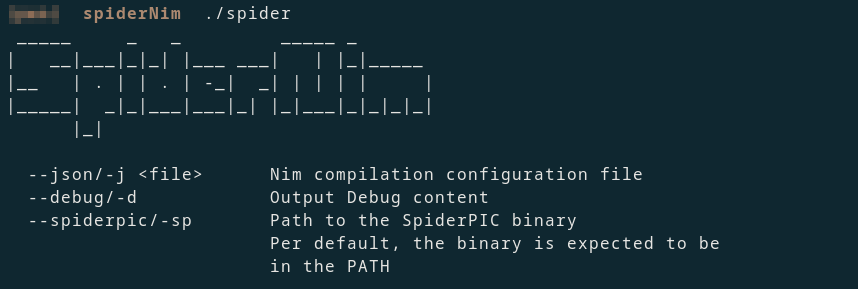

# SpiderNim


Code White developed a tool called 'SpiderPIC' to obfuscate the tooling on assembly level for their PIC C tools, as part of the compilation process.
As Nim is only a wrapper around C, this approach can be adjusted to work for all the offensive Nim tooling.


As I don't prefer some weird `makefile` action, I created a small nim tool that does the job: SpiderNim


## Usage



This can be included in the regular Nim build process. As an example:

The Nim Source Code:

```nim
echo "This is a Nim test"
```

The Command to cross-compile that for Windows (Using Mingw):

```sh
nim c -d:debug -d=mingw --app=console --cpu=amd64 test.nim
```

This will create all the `.c` and `.o` files under the following path: `$HOME/.cache/nim/test_d/*`.
The name of the folder is `<filename>_[rd]` having `r` for release and `d` for debug builds.
Under that path, Nim creates a JSON file for the build configuration. In this case: `test.json`

As this file contains all the required details for the build, it can be supplied to spiderNim.
It will then recompile all the `.c` files to assemebly, uses spiderPIC to obfuscate the assembly and compiles & links these files back to the original executable.

Use the following command for that:

```sh
./spider --json ~/.cache/nim/test_d/test.json
```

Per default, the spiderPIC executable from Code White is expected to be in $PATH, but can also be supplied with the `--spiderpic <binary>` option


**Info:** When Nim recompiles a project that does not have any changes in the source-code, it will not recompile the `.o` files and the json configuration won't include the compilation items.
To ensure that the spiderNim works after every compilation, supply the `-f` flag to force the full compilation when using the Nim compiler.


## Build

This tools does not require any 3rd party libaries and can be compiled under linux/windows/mac:

```
nim c spider.nim
```

